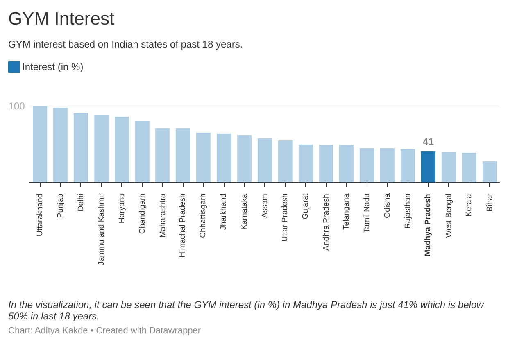

# MARKET RESEARCH FOR CLOTHING STORE

This project represents a market research and analytics study on a gym. For the sake of the project, the gym is a made-up gym called Sparta GYM to showcase the effort instead of a real gym. This gym is a tiny business with a limited customer base that caters to the lower middle class to middle class customer group and is looking to grow. It is located in Bhopal, Madhya Pradesh, India.

A thorough study has been given based on how locals' and Indians' overall interest in fitness and gyms has increased or decreased over time.

Technical models of the market research have also been used that are Buyer Persona, Porter’s Five Force Analysis, SWOT Analysis and Competitive Analysis.

Surveys and Focus Groups were not conducted due to data insufficiency because as said earlier – made up gym.

## Table of Contents

| S.No             | Title      |
| -----------------| -------------- |
| 1. | Exploratory Data Analysis |
| 2. | Buyers Persona |
| 3. | Competitive Analysis |
| 4. | SWOT Analysis |
| 5. | Porter’s Five Force Analysis |

## 1. Exploratory Data Analysis

In-depth graphical analysis using bar graphs and pie charts.

### 1.1. GYM Interest

This section shows the graphical analysis of the interest of gym all over India specially in Bhopal, Madhya Pradesh where the Sparta GYM is located. The data shows the interest from last 12 months to last 18 years. 

### 1.2. GYM Trend

This section shows the timeline of the interest of gym in Madhya Pradesh in last 12 months to last 18 years.

### 1.3. Health and Fitness Interest

This section shows the interest of health and fitness in India specially in Madhya Pradesh in last 12 months to last 18 years.

### 1.4. Health and Fitness Trend

This section gives the analytical view of health and fitness trend from last 12 months to last 18 years.

### 1.5. Body Building Interest

This section shows the interest in body building in India specially in Madhya Pradesh from past 12 months to 18 years.

### 1.6. Body Building Trend

This section gives the analytical view of body building trend in India specially in Madhya Pradesh from last 12 months to last 18 years.

### 1.7. Shoes Trend

The section shows the shoes trend which help the gym to recommend its customers which sports or training shoes should they buy.

### 1.8. Hashtag Usage

This section shows hashtag usage from all over social media platforms related to gym which can be used in promoting posts and increasing engagement.

### 1.9. GYM Related Questions

This section shows which kind of questions have been searched on Google and YouTube in India. This will help Sparta gym to focus on those area to provide better customer services.  

## 2. Buyers Persona

Buyers Persona helps to know the customers for marketing purposes and providing better customer services.

## 3. Competitive Analysis

The competitive analysis helps to know who we are competing with, their tactics and our level when compared to others which eventually results more learning and growth.

## 4. SWOT Analysis

Swot analysis helps to identify the current position of the company and what changes can be made to improvise.

## 5. Porter's Five Force Analysis

